# Super-Resolution
Final project for CIS 680. Deep learning for single image super resolution

## Introduction
This project is a tensorflow implementation of [Photo-Realistic Single Image Super-Resolution Using a Generative Adversarial Network](https://arxiv.org/pdf/1609.04802.pdf) and [Enhanced Deep Residual Networks for Single Image Super-Resolution](https://arxiv.org/pdf/1707.02921.pdf), combined with ensemble method proposed in [Learning a mixture of Deep Networks for Single Image Super-Resolution](https://arxiv.org/pdf/1701.00823.pdf).

The result is obtained following the same settings from v5 edition of [SRGAN](https://arxiv.org/pdf/1609.04802.pdf) and [EDSR](https://arxiv.org/pdf/1707.02921.pdf) winning the [NTIRE2017](http://www.vision.ee.ethz.ch/ntire17/) challenge. However, due to limited resources, the networks are trained on the [RAISE dataset](http://mmlab.science.unitn.it/RAISE/) which contains 8156 high resolution images. Tests on Set5, Set14 with different algorithms are shown below. The code is highly inspired by [pix2pix-tensorflow](https://github.com/affinelayer/pix2pix-tensorflow).

## Sample Results

<table>
    <tr>
        <td><center>LR</center></td>
        <td><center>SRResNet</center></td>
        <td><center>SRGAN</center></td>
        <td><center>EDSR</center></td>
        <td><center>ensemble</center></td>
        <td><center>HR</center></td>
    </tr>
    <tr>
        <td>
            <center></center>
        </td>
         <td>
            <center>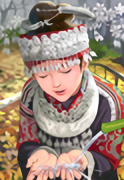</center>
        </td>
         <td>
            <center>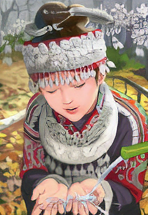</center>
        </td>
         <td>
            <center></center>
        </td>
         <td>
            <center></center>
        </td>
         <td>
            <center></center>
        </td>
    </tr>
    <tr>
        <td>
            <center></center>
        </td>
         <td>
            <center></center>
        </td>
         <td>
            <center></center>
        </td>
         <td>
            <center></center>
        </td>
         <td>
            <center>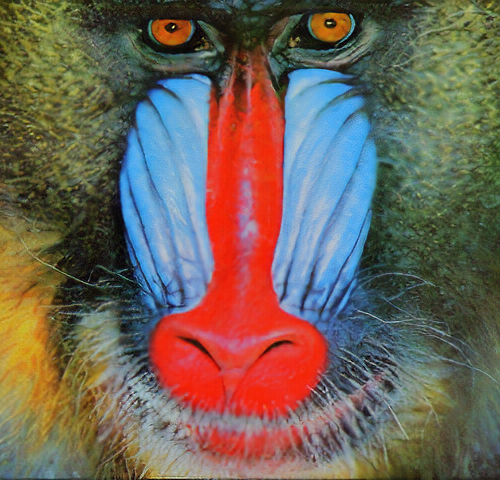</center>
        </td>
         <td>
            <center></center>
        </td>
    </tr>
</table>

## Dependency

* Python 2.7 or Python 3.5
* Tensorflow (tested on r1.4)
* Download the VGG19 weights from the [TF-slim models](http://download.tensorflow.org/models/vgg_19_2016_08_28.tar.gz)
* The code is tested on 
    * Ubuntu 16.04 LTS with CPU architecture x86_64 + NVIDIA GeForce GTX 1060, and 1080 Ti

## Getting Started

* Train the model

To train the models, follow the steps below.

1. Clone the repository

```bash
# clone the repository from github
git clone https://github.com/owenqyzhang/Super-Resolution
cd Super-Resolution
```

2. Data and checkpiont preparation

```bash
# make the directory to put the vgg19 pre-trained model
mkdir vgg19/
cd vgg19/
wget http://download.tensorflow.org/models/vgg_19_2016_08_28.tar.gz
tar xvf ./vgg19_2016_08_28.tar.gz
```

3. Train the model

run the training script
```bash
sh ./train_SRResNet.sh
```

## More results on public benchmark dataset

* Benchmark results compared to baseline algorithms

<table>
    <tr>
        <td><center>PSNR</center></td>
        <td><center>nearset</center></td>
        <td><center>bicubic</center></td>
        <td><center>SRCNN</center></td>
        <td><center>SelfExSR</center></td>
        <td><center>DRCN</center></td>
        <td><center>ESPCN</center></td>
        <td><center>SRResNet</center></td>
        <td><center>SRGAN</center></td>
        <td><center>EDSR</center></td>
        <td><center>ensemble</center></td>
    </tr>
    <tr>
        <td><center>Set5</center></td>
        <td><center>26.26</center></td>
        <td><center>28.43</center></td>
        <td><center>30.07</center></td>
        <td><center>30.33</center></td>
        <td><center>31.52</center></td>
        <td><center>30.76</center></td>
        <td><center>34.55</center></td>
        <td><center>28.90</center></td>
        <td><center>32.12</center></td>
        <td><center>31.14</center></td>
    </tr>
    <tr>
        <td><center>Set14</center></td>
        <td><center>24.64</center></td>
        <td><center>25.99</center></td>
        <td><center>27.18</center></td>
        <td><center>27.45</center></td>
        <td><center>28.02</center></td>
        <td><center>27.66</center></td>
        <td><center>27.99</center></td>
        <td><center>25.52</center></td>
        <td><center>28.54</center></td>
        <td><center>27.52</center></td>
    </tr>
</table>

* Set5

<table>
    <tr>
        <td><center>LR</center></td>
        <td><center>SRResNet</center></td>
        <td><center>SRGAN</center></td>
        <td><center>EDSR</center></td>
        <td><center>ensemble</center></td>
        <td><center>HR</center></td>
    </tr>
    <tr>
        <td>
            <center></center>
        </td>
         <td>
            <center></center>
        </td>
         <td>
            <center>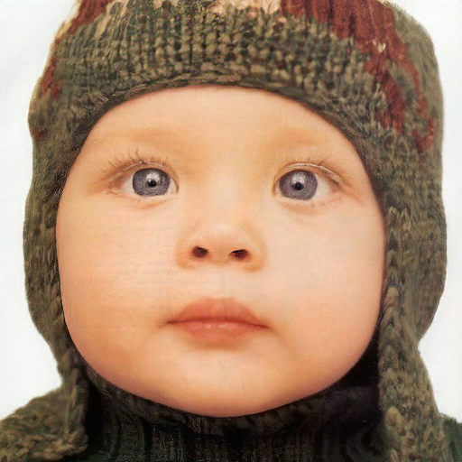</center>
        </td>
         <td>
            <center></center>
        </td>
         <td>
            <center></center>
        </td>
         <td>
            <center></center>
        </td>
    </tr>
    <tr>
        <td>
            <center></center>
        </td>
         <td>
            <center></center>
        </td>
         <td>
            <center></center>
        </td>
         <td>
            <center></center>
        </td>
         <td>
            <center></center>
        </td>
         <td>
            <center></center>
        </td>
    </tr>
    <tr>
        <td>
            <center></center>
        </td>
         <td>
            <center></center>
        </td>
         <td>
            <center></center>
        </td>
         <td>
            <center></center>
        </td>
         <td>
            <center></center>
        </td>
         <td>
            <center></center>
        </td>
    </tr>
    <tr>
        <td>
            <center></center>
        </td>
         <td>
            <center>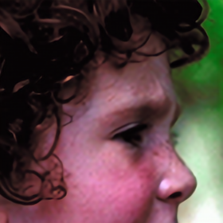</center>
        </td>
         <td>
            <center>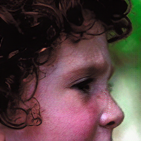</center>
        </td>
         <td>
            <center>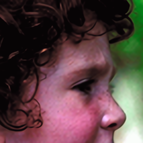</center>
        </td>
         <td>
            <center></center>
        </td>
         <td>
            <center>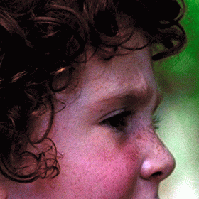</center>
        </td>
    </tr>
    <tr>
        <td>
            <center></center>
        </td>
         <td>
            <center></center>
        </td>
         <td>
            <center>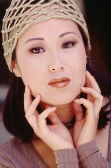</center>
        </td>
         <td>
            <center></center>
        </td>
         <td>
            <center></center>
        </td>
         <td>
            <center></center>
        </td>
    </tr>
</table>

* Set14

<table>
    <tr>
        <td><center>LR</center></td>
        <td><center>SRResNet</center></td>
        <td><center>SRGAN</center></td>
        <td><center>EDSR</center></td>
        <td><center>ensemble</center></td>
        <td><center>HR</center></td>
    </tr>
    <tr>
        <td>
            <center></center>
        </td>
         <td>
            <center></center>
        </td>
         <td>
            <center></center>
        </td>
         <td>
            <center></center>
        </td>
         <td>
            <center></center>
        </td>
         <td>
            <center></center>
        </td>
    </tr>
    <tr>
        <td>
            <center></center>
        </td>
         <td>
            <center>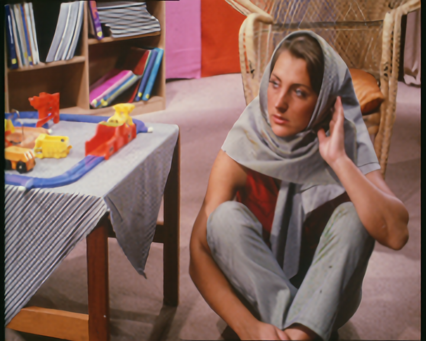</center>
        </td>
         <td>
            <center></center>
        </td>
         <td>
            <center></center>
        </td>
         <td>
            <center></center>
        </td>
         <td>
            <center></center>
        </td>
    </tr>
    <tr>
        <td>
            <center></center>
        </td>
         <td>
            <center>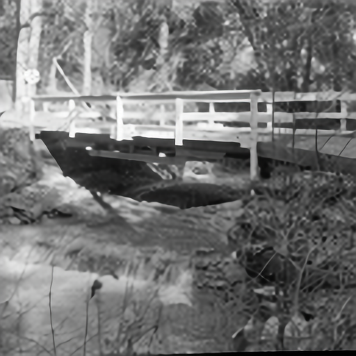</center>
        </td>
         <td>
            <center>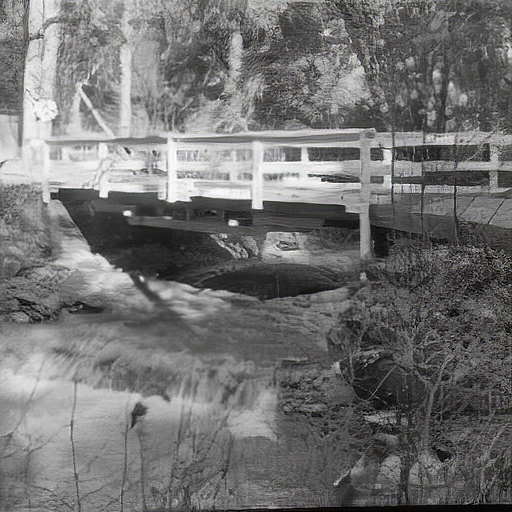</center>
        </td>
         <td>
            <center></center>
        </td>
         <td>
            <center>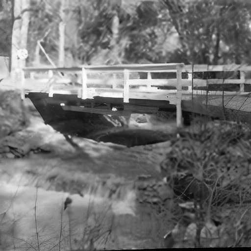</center>
        </td>
         <td>
            <center>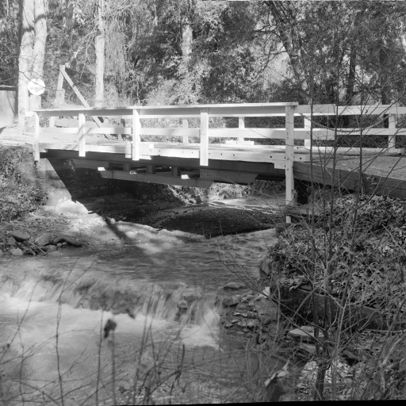</center>
        </td>
    </tr>
    <tr>
        <td>
            <center></center>
        </td>
         <td>
            <center></center>
        </td>
         <td>
            <center>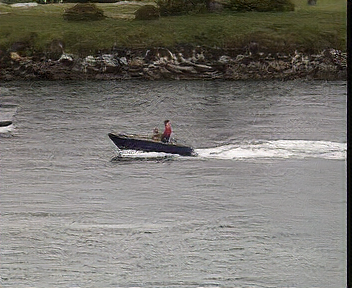</center>
        </td>
         <td>
            <center></center>
        </td>
         <td>
            <center>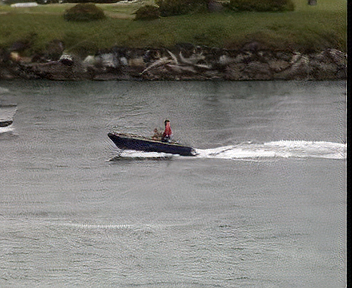</center>
        </td>
         <td>
            <center>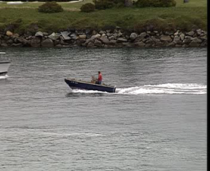</center>
        </td>
    </tr>
    <tr>
        <td>
            <center></center>
        </td>
         <td>
            <center></center>
        </td>
         <td>
            <center></center>
        </td>
         <td>
            <center></center>
        </td>
         <td>
            <center></center>
        </td>
         <td>
            <center></center>
        </td>
    </tr>
    <tr>
        <td>
            <center></center>
        </td>
         <td>
            <center></center>
        </td>
         <td>
            <center>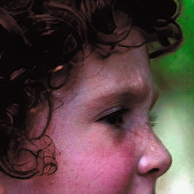</center>
        </td>
         <td>
            <center></center>
        </td>
         <td>
            <center>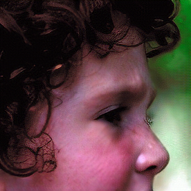</center>
        </td>
         <td>
            <center></center>
        </td>
    </tr>
    <tr>
        <td>
            <center></center>
        </td>
         <td>
            <center></center>
        </td>
         <td>
            <center></center>
        </td>
         <td>
            <center></center>
        </td>
         <td>
            <center>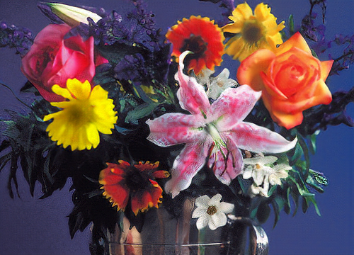</center>
        </td>
         <td>
            <center></center>
        </td>
    </tr>
    <tr>
        <td>
            <center></center>
        </td>
         <td>
            <center></center>
        </td>
         <td>
            <center></center>
        </td>
         <td>
            <center></center>
        </td>
         <td>
            <center></center>
        </td>
         <td>
            <center></center>
        </td>
    </tr>
    <tr>
        <td>
            <center></center>
        </td>
         <td>
            <center>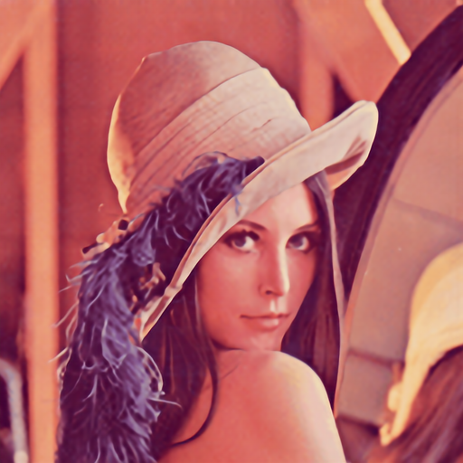</center>
        </td>
         <td>
            <center></center>
        </td>
         <td>
            <center></center>
        </td>
         <td>
            <center></center>
        </td>
         <td>
            <center></center>
        </td>
    </tr>
    <tr>
        <td>
            <center>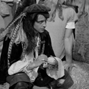</center>
        </td>
         <td>
            <center>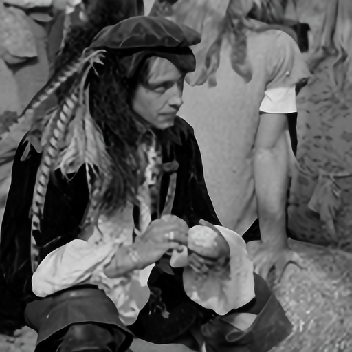</center>
        </td>
         <td>
            <center>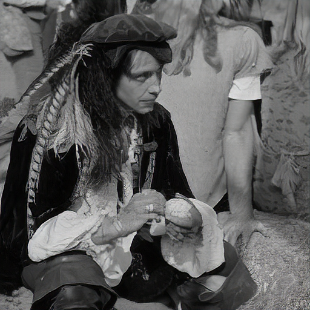</center>
        </td>
         <td>
            <center></center>
        </td>
         <td>
            <center>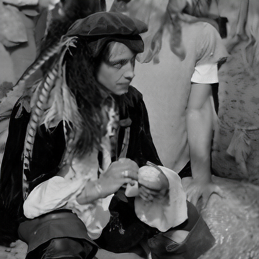</center>
        </td>
         <td>
            <center>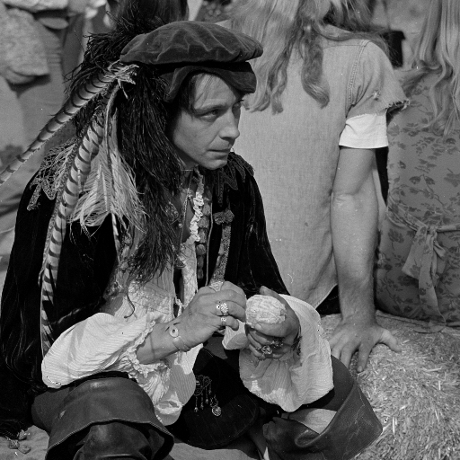</center>
        </td>
    </tr>
    <tr>
        <td>
            <center></center>
        </td>
         <td>
            <center></center>
        </td>
         <td>
            <center></center>
        </td>
         <td>
            <center></center>
        </td>
         <td>
            <center></center>
        </td>
         <td>
            <center></center>
        </td>
    </tr>
    <tr>
        <td>
            <center></center>
        </td>
         <td>
            <center></center>
        </td>
         <td>
            <center>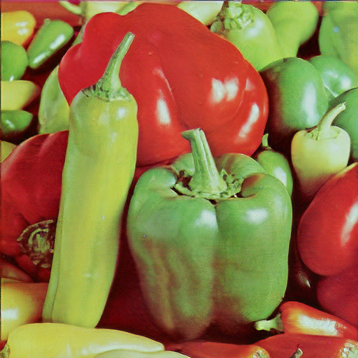</center>
        </td>
         <td>
            <center></center>
        </td>
         <td>
            <center>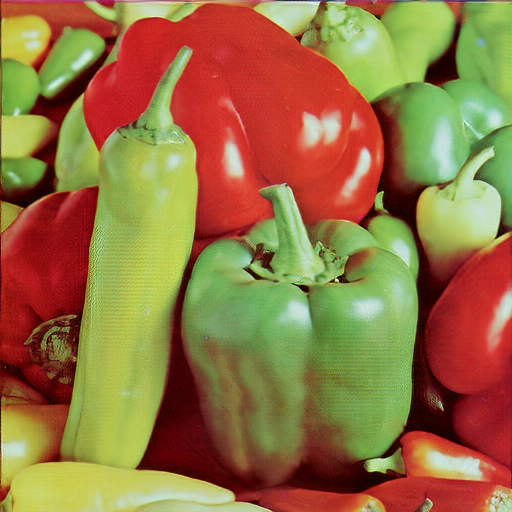</center>
        </td>
         <td>
            <center></center>
        </td>
    </tr>
    <tr>
        <td>
            <center></center>
        </td>
         <td>
            <center></center>
        </td>
         <td>
            <center>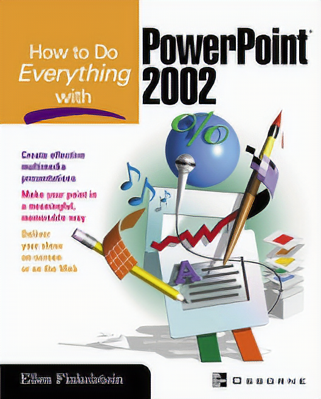</center>
        </td>
         <td>
            <center>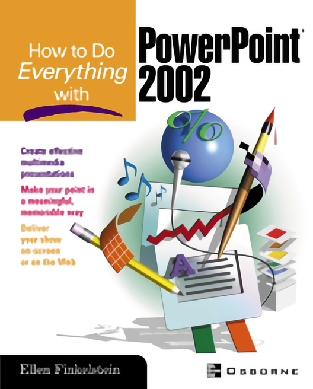</center>
        </td>
         <td>
            <center></center>
        </td>
         <td>
            <center></center>
        </td>
    </tr>
    <tr>
        <td>
            <center>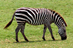</center>
        </td>
         <td>
            <center></center>
        </td>
         <td>
            <center></center>
        </td>
         <td>
            <center></center>
        </td>
         <td>
            <center>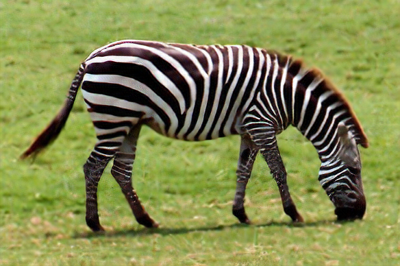</center>
        </td>
         <td>
            <center>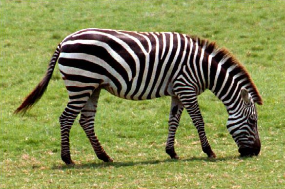</center>
        </td>
    </tr>
</table>